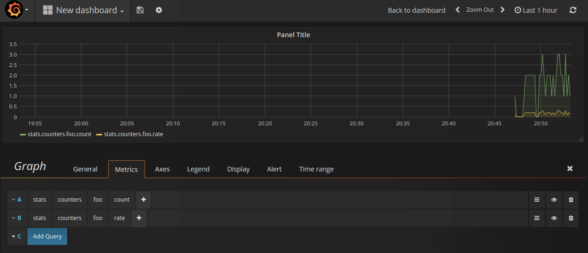

# vagrant-centos7-statsd


Following linkedin-learning course ... notes as follow 

# Running in simple debug mode

## Prereqs - yum install statsd and netcat (nc) 

```
yum -y install statsd
yum -y install nc

```

## Simple demo - running statsd in demo mode
```
[root@c7statsd ~]# tail -8 /etc/statsd/config.js
*/
{
//  graphitePort: 2003
//, graphiteHost: "localhost"
 debug: "True"
, port: 8125
```

and

```
systemctl start statsd.service 
systemctl status statsd.service 
echo "foo:1|c" |  nc -u -w10 127.0.0.1 8125
```


## Switching to docker

```
yum -y install docker
systemctl start docker.service 
systemctl status docker.service 
docker images
docker run -id -p 8000:8000 -p 3000:3000 -p 8125:8125/udp kamon/grafana_graphite
```

## Basic shell script to increment the foo counter

Populating with some basic loop / randomized sleep interval:
```
for i in {1..200}; do echo "foo:1|c" |  nc -u -w10 127.0.0.1 8125;  sleep $[ ( $RANDOM % 10 )  + 1 ]s;uptime;done 
```
although I started with a fix sleep 5s interval:
```
[c7statsd:vagrant:/vagrant] # for i in {1..20}; do echo "foo:1|c" |  nc -u -w10 127.0.0.1 8125; sleep 5;uptime;done
 18:48:14 up 21:54,  2 users,  load average: 0.00, 0.01, 0.05
 18:48:19 up 21:54,  2 users,  load average: 0.00, 0.01, 0.05
 18:48:24 up 21:54,  2 users,  load average: 0.00, 0.01, 0.05
 18:48:29 up 21:54,  2 users,  load average: 0.00, 0.01, 0.05
 18:48:34 up 21:54,  2 users,  load average: 0.00, 0.01, 0.05
 18:48:39 up 21:54,  2 users,  load average: 0.00, 0.01, 0.05
 18:48:44 up 21:54,  2 users,  load average: 0.00, 0.01, 0.05
 18:48:50 up 21:54,  2 users,  load average: 0.00, 0.01, 0.05
 18:48:55 up 21:54,  2 users,  load average: 0.00, 0.01, 0.05
 18:49:00 up 21:54,  2 users,  load average: 0.00, 0.01, 0.05
 18:49:05 up 21:54,  2 users,  load average: 0.00, 0.01, 0.05
 18:49:10 up 21:55,  2 users,  load average: 0.00, 0.01, 0.05
 18:49:15 up 21:55,  2 users,  load average: 0.00, 0.01, 0.05
 18:49:20 up 21:55,  2 users,  load average: 0.00, 0.01, 0.05
^C
[c7statsd:vagrant:/vagrant] # for i in {1..200}; do echo "foo:1|c" |  nc -u -w10 127.0.0.1 8125;  sleep $[ ( $RANDOM % 10 )  + 1 ]s;uptime;done 
 18:49:51 up 21:55,  2 users,  load average: 0.00, 0.01, 0.05
 18:50:00 up 21:55,  2 users,  load average: 0.00, 0.01, 0.05
 18:50:01 up 21:55,  2 users,  load average: 0.00, 0.01, 0.05
 18:50:04 up 21:55,  2 users,  load average: 0.00, 0.01, 0.05
 18:50:10 up 21:56,  2 users,  load average: 0.00, 0.01, 0.05
 18:50:12 up 21:56,  2 users,  load average: 0.00, 0.01, 0.05
 ....
```
## hello-statsd-grafana-world.png

Now in grafana we can add a query 
* statsd > counter > foo > count
* statsd > counter > foo > rate




